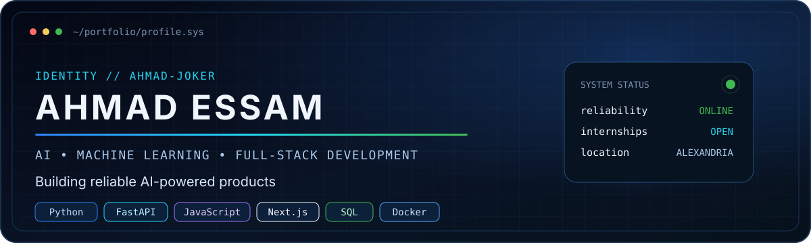
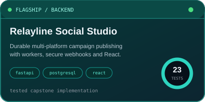
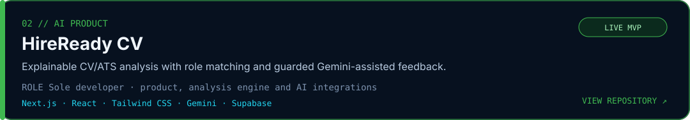
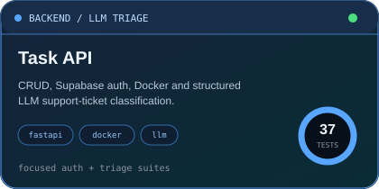
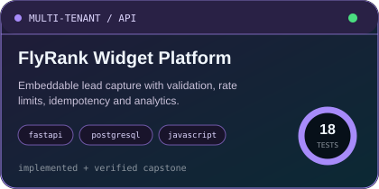
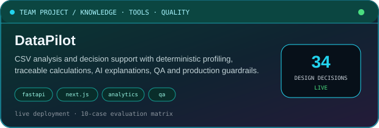

<p align="center">
  
</p>

## System information

```text
┌─ ahmad@portfolio ─────────────────────────────────────────────────────┐
│ role        AI/ML & Full-Stack Developer                              │
│ education   BSc Artificial Intelligence · AAST                        │
│ graduation  2028                                                      │
│ location    Alexandria, Egypt                                         │
│ focus       Applied AI · backend APIs · reliable AI integration       │
│ status      Building, learning and open to internships                │
│ strengths   Python · ML · backend · APIs · testing · integration      │
└───────────────────────────────────────────────────────────────────────┘
```

## About

I build AI-powered web applications and dependable backend systems. I am especially interested in turning AI ideas into working products through tested APIs, usable interfaces, deterministic data processing, and responsible AI integration.

## Featured projects

<a href="https://github.com/Ahmad-Joker/relayline-social-studio">
  
</a>

<a href="https://github.com/Ahmad-Joker/hireready-cv-final">
  
</a>

**Live:** [hireready-cv-final.vercel.app](https://hireready-cv-final.vercel.app)

<a href="https://github.com/Ahmad-Joker/task-api">
  
</a>

<a href="https://github.com/Ahmad-Joker/flyrank-capstone-widget-platform">
  
</a>

<a href="https://github.com/AhmedMohamedAbdelHamid/DataPilot-Project">
  
</a>

**Live:** [data-pilot-project.vercel.app](https://data-pilot-project.vercel.app)

## Technical stack

| Area | Technologies |
| --- | --- |
| **AI & Data** | `Python` `Pandas` `NumPy` `scikit-learn` `Gemini API` |
| **Backend** | `FastAPI` `Node.js` `REST APIs` `PostgreSQL` `MySQL` |
| **Frontend** | `JavaScript` `React` `Next.js` `HTML` `CSS` `Tailwind CSS` |
| **Engineering** | `Git` `GitHub` `Docker` `Docker Compose` `pytest` `API testing` |
| **Embedded Systems** | `C` `ATmega32` `UART` `I²C` `PWM` |

## GitHub activity

<p align="center">
  
</p>

<p align="center">
  
  
</p>

<p align="center">
  
</p>

<sub>GitHub's native contribution calendar and activity feed appear below this profile README.</sub>

## Current focus

- Applied machine learning and production-style AI integration
- Backend architecture, retrieval systems, and AI APIs
- Dockerized services, testing, and reliable software delivery

## Achievements

- Two-time VEX IQ Egypt National Champion team leader
- FIRST LEGO League Core Values Award
- IGCSE graduate with a 98% overall result

## Contact

| Channel | Link |
| --- | --- |
| GitHub | [github.com/Ahmad-Joker](https://github.com/Ahmad-Joker) |
| Live product | [HireReady CV](https://hireready-cv-final.vercel.app) |

<p align="center"><sub>Open to AI/ML, AI data-training, full-stack AI, and software-engineering internships.</sub></p>
