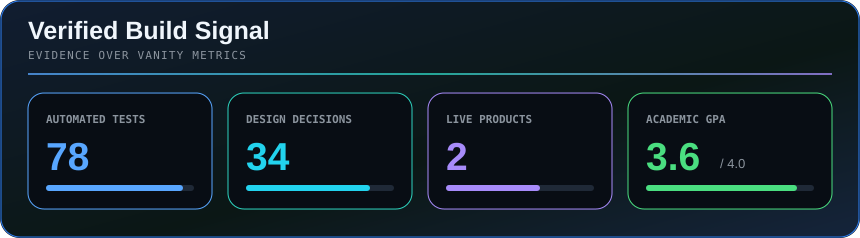
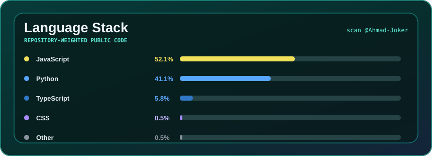

  

  <a href="https://github.com/Ahmad-Joker">GitHub</a> &nbsp;·&nbsp;
  <a href="https://hireready-cv-final.vercel.app">HireReady Live</a> &nbsp;·&nbsp;
  <a href="https://data-pilot-project.vercel.app">DataPilot Live</a>

  AI undergraduate at AAST turning applied AI ideas into tested products, dependable APIs, and clear user experiences.

  

Automatic contribution chess replay · generated from public GitHub activity

  

## What I build

- **AI-assisted products** that combine deterministic application logic with responsible LLM integration.
- **Backend systems and APIs** with FastAPI, PostgreSQL, authentication, validation, Docker, and automated tests.
- **Full-stack experiences** with Next.js, React, Node.js, relational data, and production deployment.
- **Machine-learning workflows** spanning EDA, preprocessing, feature engineering, model comparison, and evaluation.

## Featured work

  
  

  
  

  

### Project notes

- **[Relayline Social Studio](https://github.com/Ahmad-Joker/relayline-social-studio)** - Durable multi-platform campaign publishing with FastAPI, PostgreSQL, React, background workers, secure webhooks, and 23 passing tests.
- **[HireReady CV](https://github.com/Ahmad-Joker/hireready-cv-final)** - Live AI-assisted ATS analysis for Egypt and UK applicants using Next.js, Gemini, Supabase, and deterministic scoring. [Open the product](https://hireready-cv-final.vercel.app).
- **[Task API](https://github.com/Ahmad-Joker/task-api)** - FastAPI and PostgreSQL CRUD, Supabase authentication, Docker, and structured LLM support-ticket triage backed by 37 focused tests.
- **[FlyRank Widget Platform](https://github.com/Ahmad-Joker/flyrank-capstone-widget-platform)** - Multi-tenant lead capture with validation, rate limiting, idempotency, analytics, Docker, and 18 passing tests.
- **[DataPilot](https://github.com/AhmedMohamedAbdelHamid/DataPilot-Project)** - Team-built CSV analysis and decision-support studio. I contributed as Knowledge, Tools and Quality Engineer across deterministic profiling, AI guardrails, QA, integration, and documentation. [Open the product](https://data-pilot-project.vercel.app).

## Experience

### DataPilot - Cross-Functional AI and Full-Stack Contributor · 2026

- Contributed across backend APIs, deterministic dataset profiling, AI integration, frontend workflows, system integration, testing, and technical documentation.
- Helped define **34 design decisions** covering statistics, missing values, duplicate handling, quality rules, traceability, and the boundary between deterministic code and generative AI.
- Prepared benchmark datasets, expected outputs, injection and invalid-input checks, interpretation guardrails, and a 10-case reliability evaluation matrix.

### Toyota Internship - Body Repair, Mechanical Operations and Technical Support · September 2026

- Completed rotations across panel and body-repair workflow, mechanical service operations, and customer-facing technical support.
- Studied the service journey from job-card intake and coded work orders through coordination, repair updates, and customer communication, then documented opportunities for AI-assisted support.

### AI and LLM Workshop Facilitator · 2026

- Designed a 60-90 minute beginner workshop covering AI, machine learning, deep learning, generative AI, LLMs, responsible use, model selection, and practical marketing applications.
- Produced separate learner and trainer decks, speaker notes, exercises, model comparisons, practical tasks, timing guidance, and multilingual explanations in English, Arabic, and Franco-Arabic.

## Language stack

  

| Area | Technologies and methods |
| --- | --- |
| **AI and Data** | `Python` `Pandas` `NumPy` `scikit-learn` `Matplotlib` `Seaborn` `EDA` `Regression` `Classification` `Cross-validation` |
| **AI and LLM Engineering** | `Gemini` `Claude` `OpenAI` `Amazon Bedrock` `Prompt engineering` `Output validation` `AI API integration` |
| **Backend** | `FastAPI` `Node.js` `Express` `REST APIs` `PostgreSQL` `MySQL` `Supabase` `Pydantic` |
| **Frontend** | `JavaScript` `TypeScript` `React` `Next.js` `Tailwind CSS` `HTML5` `CSS3` |
| **Delivery** | `Git` `GitHub` `Docker` `Docker Compose` `pytest` `Vercel` `API testing` |
| **Embedded and Networks** | `C` `C++` `ATmega32A` `ESP32` `UART` `I2C` `PWM` `Cisco Packet Tracer` |

## Selected academic and independent projects

- **CodeRise - AI-Powered Coding Learning Platform:** Full-stack JavaScript, Node.js, Express, and MySQL platform with session authentication, progress tracking, Claude-powered code feedback, in-browser Python execution through Pyodide, and interactive Three.js scenes.
- **Car Price Prediction:** End-to-end regression workflow on the CarDekho dataset with EDA, missing-data handling, encoding, outlier treatment, feature engineering, cross-validation, GridSearchCV, RMSE, and R-squared comparison.
- **Network Packet Capture Modelling:** Separate classification and regression workflows with exploratory analysis, feature selection, preprocessing, comparative evaluation, visualisation, and documented limitations.
- **Gesture-Controlled Vehicle:** Four-motor vehicle controlled by hand orientation using an MPU6050, ESP32 BLE, ATmega32A, dual L298N drivers, UART, I2C, PWM, and a communication failsafe.
- **Hospital Management System:** Modular C application using structs, queues, stacks, linked lists, and a binary search tree to manage patients, records, service order, and operational workflows.

## Education and training

- **BSc in Artificial Intelligence**, Arab Academy for Science, Technology and Maritime Transport - Alexandria, Egypt · Expected 2028 · **GPA 3.6**
- **IGCSE Certificate**, El Quds International School · 2024 · **98% overall**
- **AWS AI Practitioner Challenge**, Udacity and Amazon Web Services · 2026
- **AI Diploma**, Iromi Elite · 2026
- **Digital Marketing Diploma and Business Camp**, Iromi Elite · 2026
- **Automation Workflows Workshop**, Iromi Elite · 2026
- **Competitive Programming Training**, ECPC Track at AAST · 2025

## Achievements and leadership

- **VEX IQ Robotics Team Leader** - 1st Place Egypt Nationals for two consecutive years.
- **FIRST LEGO League Core Values Award** - teamwork, innovation, communication, and collaborative problem solving.
- **Model United Nations Delegate** - public speaking, formal proposal writing, negotiation, and structured debate.

## GitHub activity

  

  
  

  

## Current direction

I am currently strengthening applied machine learning, retrieval systems, backend architecture, evaluation, and production-style AI integration. I am open to **AI/ML, AI data-training, full-stack AI, backend, and software-engineering internships**.

  <strong>Alexandria, Egypt</strong> &nbsp;·&nbsp; Building reliable AI-powered products &nbsp;·&nbsp; Remote ready

